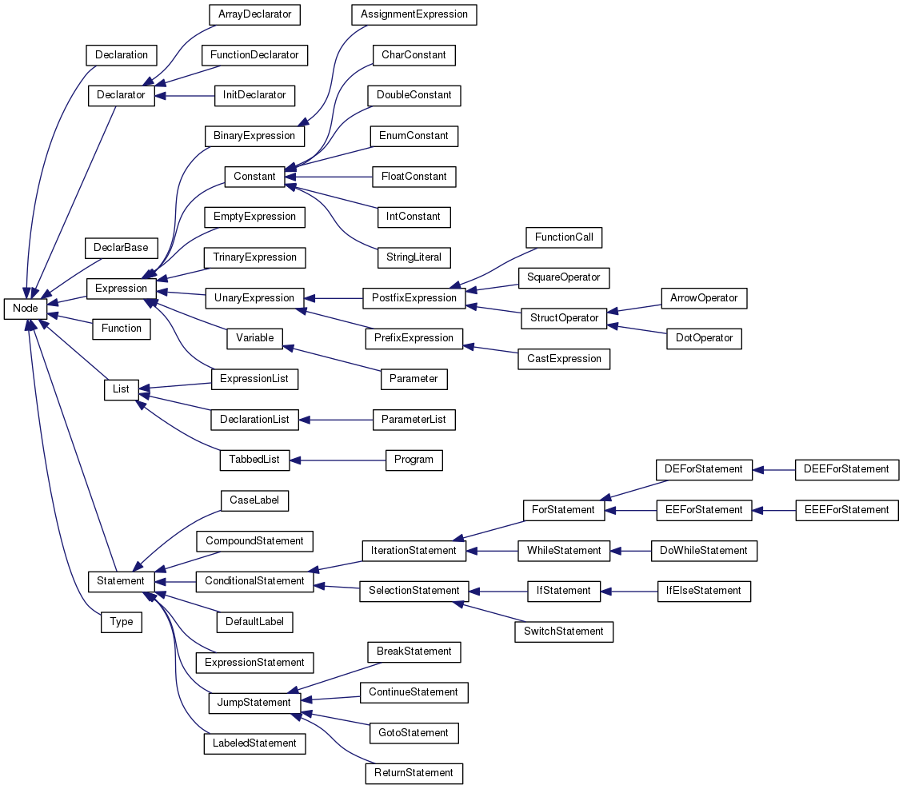

Documentation
=============

In total the documentation burden is (at most) 1000 words
plus one diagram. Assesment of the documentation is not relative
to compiler functionality, it just requires a description
of the compiler as-is, and a realistic assessment of the
compiler's strengths and weaknesses.

AST
===

Overview Diagram
----------------

_Add a diagram of your AST, which is designed to *usefully* communicate
the *important* properties of the AST._

- _Use whatever level of detail you feel is appropriate_.

- _You do not need to include every part of the AST, and you
  don't need to include every class_.

- _Zooming should not be necessary to understand it_.

The file should be called `my-ast.png`. The software used
to generate the png is up to you, or you can draw it by hand
and scan it if you wish (though beware the eventual file-size).

Description
-----------

_Describe the structure and organisation of your AST in 200 words
or fewer_.

- _Feel free to refer to your diagram_.

- _Try to capture the most important properties_.

- _You can use code, but it is included in your budget_.

Strengths
---------

_Give two strengths or capabilites of your AST, using 50 words or less for each one_.

### Strength 1

_50 words or less_

### Strength 2

_50 words or less_

Limitations
-----------

_Give two limitations of your AST, using 50 words or less for each one_.

### Limitation 1

_50 words or less_

### Limitation 2

_50 words or less_

Variable binding
================

General approach
----------------

_Describe your overall approach to mapping variable, parameters, etc.
into registers or memory locations at exection time, using 200 words
or less_.

- _how did you manage registers?_
- _did you use the stack?_
- _is there a function or API for managing and looking up bindings?_

_200 words or less_

Strengths
---------

_Give two strengths or capabilites of your binding approach, using 50 words or less for each one_.

### Strength 1

_50 words or less_

### Strength 2

_50 words or less_

Limitations
-----------

_Give two limitations of your binding approach, using 50 words or less for each one_.

### Limitation 1

_50 words or less_

### Limitation 2

_50 words or less_

Reflection
==========

Strengths
---------

_What two aspects of your compiler do you think work well (beyond
those identified in the AST and binding parts)?_

### Strength 1

_50 words or fewer_

### Strength 2

_50 words or fewer_

Scope for Improvment
---------------------

_What parts of your compiler do you think could be improved?_

- _This is not looking for things like "It should support more C constructs". What
  would you need to do or change in order to support those things?_

### Improvement 1

_50 words or fewer_

### Improvement 2

_50 words or fewer_

Functionality (not assessed)
============================

Which of these features does your compiler support (insert
an `x` to check a box):

1 - [ ] Local variables
2 - [ ] Integer arithmetic
3 - [ ] While
4 - [ ] IfElse
5 - [ ] For
6 - [ ] Function calls
7 - [ ] Arrays
8 - [ ] Pointers
9 - [ ] Strings
10 - [ ] Structures
11 - [ ] Floating-point

Note that all features will be tested, regardless of what
appears here. This is documentation of what you expect to work,
versus what doesn't work.

Feedback (not assessed)
=======================

_What aspects of your compiler would you like feedback on.
Be specific, as "what could I have done differently" is
too general to answer._

### Feedback 1

_20 words or fewer_

### Feedback 2

_20 words or fewer_

