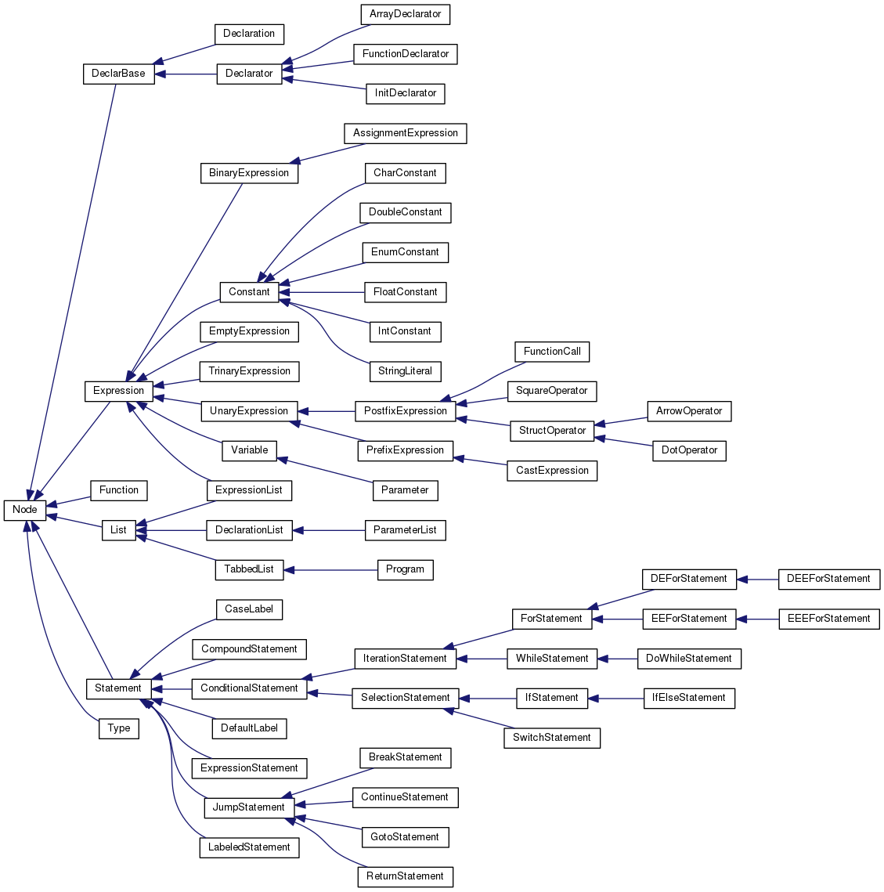

Documentation
=============

In total the documentation burden is (at most) 1000 words
plus one diagram. Assesment of the documentation is not relative
to compiler functionality, it just requires a description
of the compiler as-is, and a realistic assessment of the
compiler's strengths and weaknesses.

AST
===

Overview Diagram
----------------

_Add a diagram of your AST, which is designed to *usefully* communicate
the *important* properties of the AST._
  

Description
-----------

_Describe the structure and organisation of your AST in 200 words
or fewer_.

- _Feel free to refer to your diagram_.

- _Try to capture the most important properties_.

- _You can use code, but it is included in your budget_.

- Everything inherits from Node
- 
- 

Strengths
---------

_Give two strengths or capabilites of your AST, using 50 words or less for each one_.

### Strength 1

Metadata is extremely easy to add to each of the nodes in the tree. This is because of the `vector<const Node *> getChildren()` function, which adds some of the power of generic programming to my AST. Only need to write a couple functions to populate the whole tree.

_50 words or less_

### Strength 2

_50 words or less_

Limitations
-----------

_Give two limitations of your AST, using 50 words or less for each one_.

### Limitation 1

Biggest limitation: my AST is too generic. I was unable to refer to specific classes and had to use const Node \*s for most class constructors/arguments, which meant later on either casting or defining methods in Node was required in order to access the functionality I needed.

_50 words or less_

### Limitation 2

_50 words or less_

Variable binding
================

General approach
----------------

_Describe your overall approach to mapping variable, parameters, etc.
into registers or memory locations at exection time, using 200 words
or less_.

- _how did you manage registers?_
- _did you use the stack?_
- _is there a function or API for managing and looking up bindings?_

For most functionalities I only used registers $2 and $3, and for example in a nested addition where $3 would get overwritten, I push and pop $3 onto the stack. In functions, $3 would get overwritten by recursive function calls, so I saved it in $16 ($s0), a _Saved Register_. Finally, for array and pointer access, since it involves a number of additional registers in order to load the correct address, I used some of the unused _Temporary Registers_ $8-$15 since they are not used elsewhere and there would be no risk of overwriting other important registers. 
I created a class called `Context`, which is passed through to all of the `print_asm` functions. The class has an API for managing the bindings, and helper functions to help manage how the stack is used.

_200 words or less_

Strengths
---------

_Give two strengths or capabilites of your binding approach, using 50 words or less for each one_.

### Strength 1

_50 words or less_

### Strength 2

_50 words or less_

Limitations
-----------

_Give two limitations of your binding approach, using 50 words or less for each one_.

### Limitation 1

Every use of any variable involves loading them from the stack into a register, and then storing them back on the stack. This is probably the slowest possible way to manage variable binding, but the was very easy to implement.

_50 words or less_

### Limitation 2

The strategy of using unused temporary registers when new, more complicated functionality requires more register usage will eventually lead to registers being quite randomly allocated for different uses. It would be better to plan out register usage from the beginning.

_50 words or less_

Reflection
==========

Strengths
---------

_What two aspects of your compiler do you think work well (beyond
those identified in the AST and binding parts)?_

### Strength 1

_50 words or fewer_

### Strength 2

_50 words or fewer_

Scope for Improvment
---------------------

_What parts of your compiler do you think could be improved?_

- _This is not looking for things like "It should support more C constructs". What
  would you need to do or change in order to support those things?_

### Improvement 1

_50 words or fewer_

### Improvement 2

Writing more helper functions for the different instructions or repeated actions that are used, to compartmentalise their complexity. For example, an `add(ctxt,left,right,dest)` function would help alleviate the issues I was having trying to figure out how to implement the different types of add (signed, unsigned, floating point).

_50 words or fewer_

Functionality (not assessed)
============================

Which of these features does your compiler support (insert
an `x` to check a box):

1 - [x] Local variables
2 - [x] Integer arithmetic
3 - [x] While
4 - [x] IfElse
5 - [x] For
6 - [x] Function calls
7 - [x] Arrays
8 - [x] Pointers
9 - [x] Strings
10 - [ ] Structures
11 - [ ] Floating-point

Note that all features will be tested, regardless of what
appears here. This is documentation of what you expect to work,
versus what doesn't work.

Feedback (not assessed)
=======================

_What aspects of your compiler would you like feedback on.
Be specific, as "what could I have done differently" is
too general to answer._

### Feedback 1

_20 words or fewer_

### Feedback 2

_20 words or fewer_
